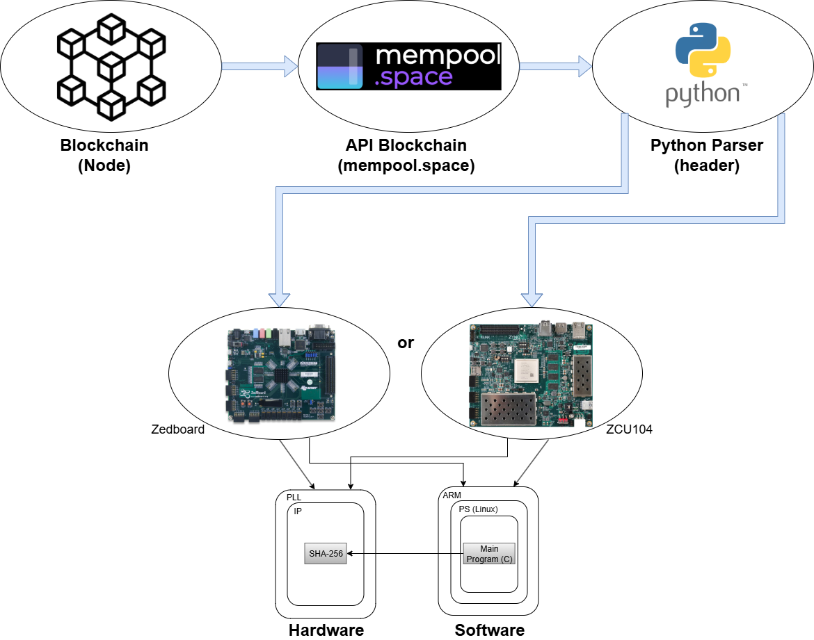
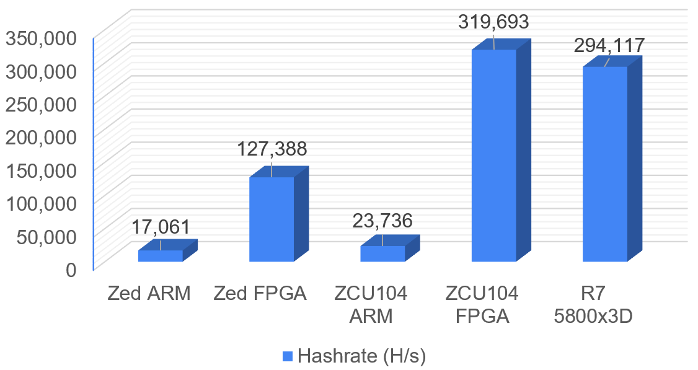
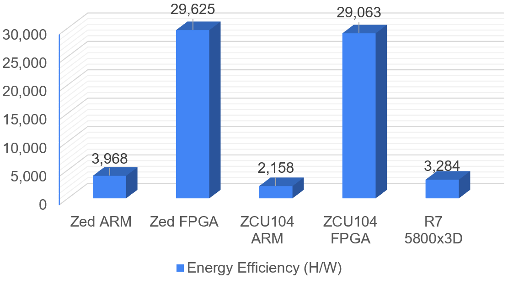
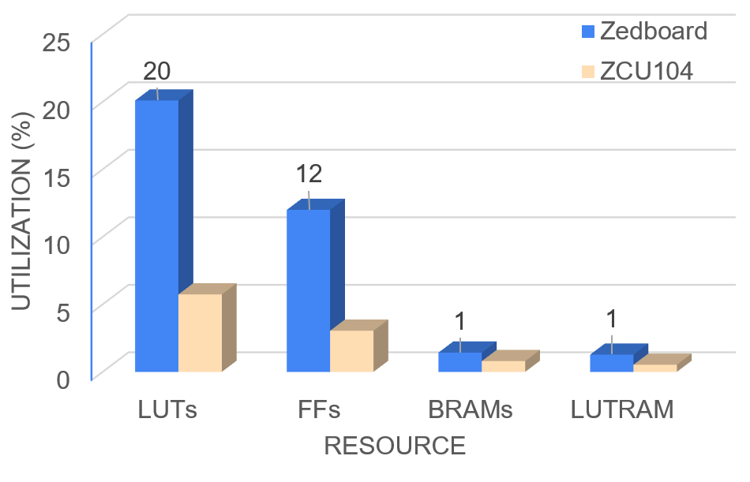

# Double SHA-256 em FPGA (HLS) usando blocos reais do Bitcoin

Implementação do **Double SHA-256** (SHA-256 aplicado duas vezes, como no Bitcoin) em **FPGA** via **High-Level Synthesis (HLS)**, empacotada como **IP** e integrada em sistemas **bare-metal** nos SoCs **Xilinx Zynq**.

Este repositório contém:
- O **TCC** (LaTeX) e o **paper** (IEEE) gerados a partir do trabalho.
- Implementações em **C** (referência / teste em PC) e em **C para HLS**.
- Projetos completos para **Vivado / Vitis HLS / Vitis Baremetal** nas placas **ZedBoard (Zynq-7000)** e **ZCU104 (Zynq UltraScale+ MPSoC)**.

## Contexto e objetivo
O SHA-256 é um algoritmo criptográfico central para a segurança da blockchain do Bitcoin. O protocolo utiliza **Double SHA-256** no cabeçalho do bloco (80 bytes).

**Objetivo do TCC:** avaliar a viabilidade e eficiência de executar o Double SHA-256 em **hardware reconfigurável (FPGA)** usando **HLS**, validando a corretude com **cabeçalhos reais** extraídos da blockchain.

> Importante: este projeto **não é um minerador** (não varre nonces nem tenta encontrar blocos). A validação aqui é: dado um *header* com nonce conhecido, calcular o Double SHA-256 e comparar com o hash publicado.

## Visão geral da solução
O fluxo completo é:
1. Um script em Python consulta a API pública do **mempool.space** e monta o **block header** (80 bytes, little-endian).
2. O ARM (PS) recebe o header, calcula o Double SHA-256 em software (baseline) e também envia o header para o IP em HLS (PL) via **AXI4-Lite**.
3. O IP devolve o hash final (256 bits). Os resultados são comparados com o hash real do bloco.

### Diagramas (arquitetura e fluxo)

**Visão geral (paper):**



**Fluxo de validação (sequência):**
- PDF: [paper/img/diagrama_sequencia_ingles.pdf](paper/img/diagrama_sequencia_ingles.pdf)

**Fluxograma do `sha256_top` (HLS):**
- PDF: [paper/img/fluxograma_sha256_top.pdf](paper/img/fluxograma_sha256_top.pdf)

**Arquitetura de hardware (interno do IP):**
- PDF: [paper/img/diagrama_hardware.pdf](paper/img/diagrama_hardware.pdf)

## Resultados (resumo)
Métricas medidas em execução real nas placas (bare-metal) e com medição externa de potência.

### Desempenho e energia

| Plataforma | Execução | Clock PL | Tempo por hash | Hashrate | Potência (W) | Eficiência (H/W) |
|---|---:|---:|---:|---:|---:|---:|
| ZedBoard (Cortex-A9) | CPU | — | 58,607 µs | 17,062 kH/s | ~4,3 | 3.967 |
| ZedBoard (Zynq-7000) | FPGA (HLS IP) | 100 MHz | 7,850 µs | 127,388 kH/s | ~4,3 | 29.625 |
| ZCU104 (Cortex-A53) | CPU | — | 42,030 µs | 23,792 kH/s | ~11,0 | 2.158 |
| ZCU104 (UltraScale+) | FPGA (HLS IP) | 250 MHz | 3,128 µs | 319,693 kH/s | ~11,0 | 29.063 |

Gráficos usados no paper:





### Utilização de recursos FPGA

| Recurso | ZedBoard (Zynq-7000) | ZCU104 (UltraScale+) |
|---|---:|---:|
| LUTs | 10.709 (20,1%) | 13.231 (5,74%) |
| FFs | 12.804 (12,0%) | 14.062 (3,05%) |
| BRAM | 2 (1,43%) | 2,5 (0,80%) |
| LUTRAM | 222 (1,28%) | 544 (0,53%) |



## Estrutura do repositório

- `src/C/`
  - Implementação em C para testes em PC (inclui `main.c`, `sha256.c`, `sha256_top.c`).
  - Batch de compilação rápida: `src/C/_compile.bat`.

- `src/Python/`
  - Script para buscar e montar headers reais: `src/Python/mempool.py`.

- `src/Zedboard/` e `src/ZCU104/`
  - `Vitis_HLS/`: componente HLS e fontes (`sha256.c`, `sha256.h`, `sha256_top.c`).
  - `Vivado/`: projeto com block design e export de hardware (`sha256_top.xsa`).
  - `Vitis_Baremetal/`: aplicação bare-metal que compara CPU vs IP e mede tempo/"hashrate".

- `tex/`
  - Fonte do TCC em LaTeX (ABNT).

- `paper/`
  - Fonte do paper IEEE, imagens e PDF final.

## Como reproduzir (rápido)

### 1) Gerar um header real (Python)
Requisitos: Python 3 + `requests`.

```bash
pip install requests
python src/Python/mempool.py
```

O script imprime:
- O **header** (80 bytes, hex, little-endian)
- O **double hash** (LE e BE)
- O **hash do bloco** fornecido pelo mempool.space

### 2) Rodar o teste em PC (C)
Requisitos: `gcc` no Windows (MinGW/WSL/MSYS2).

- Execute: `src/C/_compile.bat`

Esse executável valida a implementação do Double SHA-256 usando um header/hashes fixos (exemplo do trabalho).

### 3) Rodar em FPGA (ZedBoard / ZCU104)
Fluxo típico (resumo):
1. Abrir o projeto Vivado da placa e gerar bitstream.
2. Exportar hardware (XSA) e abrir no Vitis.
3. Compilar e rodar a aplicação bare-metal.

O código bare-metal faz:
- cálculo em CPU (função `sha256_top` em software)
- escrita do header nos registradores do IP via AXI4-Lite
- start/poll (`ap_start`/`ap_done`) e leitura do hash final
- leitura do contador de ciclos via AXI GPIO (ver `cycle_counter.vhd`)

Observação: os endereços-base do IP variam por plataforma e dependem do Address Editor no Vivado:
- ZedBoard usa `0x4000_0000` (ver `src/Zedboard/Vitis_Baremetal/sha256/src/main.c`)
- ZCU104 usa `0xA000_0000` (ver `src/ZCU104/Vitis_Baremetal/main.c`)

## Documentos

- Paper (PDF): [paper/Paper_IEEE__Double_SHA_256_HLS_IP__Conference_.pdf](paper/Paper_IEEE__Double_SHA_256_HLS_IP__Conference_.pdf)
- TCC (fontes LaTeX): [tex/main.tex](tex/main.tex)

## Autor e orientação
- Autor: **Bernardo Vannier Soares Pinto**
- Orientador: **Felipe Viel, MSc.**

## Referência / como citar
Se você usar este trabalho como base, cite o TCC ou o paper (ver bibliografias em `tex/refs.bib` e `paper/refs.bib`).

---

Se você quiser, eu também posso:
- adicionar uma seção “Reprodução passo a passo” com prints do Vivado/Vitis (ex.: onde importar o XSA e onde ajustar o clock do PL),
- ou criar um `docs/` com imagens PNG exportadas dos `.drawio` para o GitHub renderizar tudo inline.
